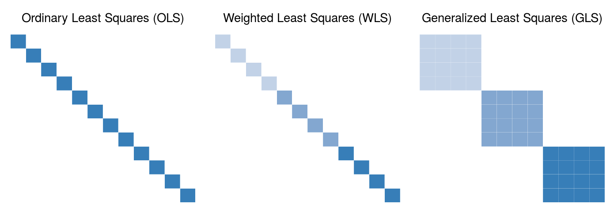

# R package wlm

[](https://travis-ci.org/variani/wlm)




See [Fitting linear mixed models for QTL mapping](https://kbroman.wordpress.com/2015/11/24/fitting-linear-mixed-models-for-qtl-mapping/) blog post by Karl Broman 
for examplanation of the eigen-decomposition trick possible for LMM1 model (1 random genetic + 1 random noise effects).

```
library(wlm)

# data
data(mtcars)

mtcars <- within(mtcars, {
  cyl <- factor(cyl)
  weight_cyl = 1/sqrt(as.numeric(cyl))
})
  
# OLS
m1 <- lm(mpg ~ disp + cyl, mtcars)

# WLS
m2 <- lm(mpg ~ disp, mtcars, weights = weight_cyl)

# GLS
varcov_cyl <- with(mtcars, sapply(cyl, function(x) as.numeric(x) * as.numeric(x == cyl)))

m3 <- wlm(mpg ~ disp, mtcars, varcov = varcov_cyl)

# LMM1
varcov_cyl <- with(mtcars, sapply(cyl, function(x) as.numeric(x == cyl)))

m4 <- lmm1(mpg ~ disp, mtcars, varcov = varcov_cyl)

#> m4$lmm$r2
#[1] 0.1049433
# ~10% of variance explained by the random effect with `varcov = varcov_cyl`

# LMM1 + precomputed eigendecomposition 
evd_varcov_cyl <- eigen(varcov_cyl)

m5 <- lmm1(mpg ~ disp, mtcars, varcov = evd_varcov_cyl)

# Computation time of LMMs
system.time(lmm1(mpg ~ disp, mtcars, varcov = varcov_cyl))
#   user  system elapsed
#  0.005   0.000   0.005

library(lme4qtl)
system.time(lmer(mpg ~ disp + (1|cyl), mtcars))
#   user  system elapsed
#  0.014   0.000   0.014
```
