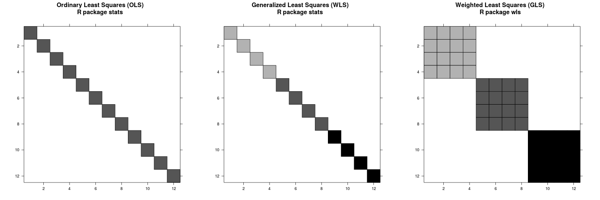

# About



# Example

```
data(longley)
nobs <- nrow(longley)

rho <- 0.64417
V <- diag(nobs)
V <- rho^abs(row(V) - col(V))
```

```
library(wls)
  
m <- wlm(Employed ~ GNP + Population, data = longley, varcov = V)
```

```
library(nlme)

m0 <- gls(Employed ~ GNP + Population, correlation = corAR1(form = ~Year), data = longley)
```
